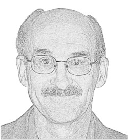

# Jack's Research

I consider myself a logical person, a seeker after truth. I do not have time to check everything out, but I do my best. I follow the words of Jesus who said, “You shall know the truth and the truth shall set you free.” In the context, that truth relates to his own teaching. Jesus does seem to indicate that truth is knowable and I just like to pursue truth to see where it leads me. I hope you also gain benefit from my research.